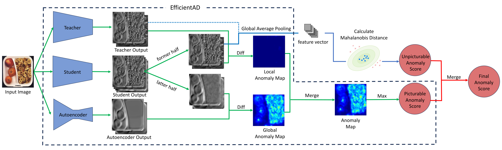

[](https://paperswithcode.com/sota/anomaly-detection-on-mvtec-loco-ad?p=puad-frustratingly-simple-method-for-robust-1)

# PUAD
Official implementation of the paper [PUAD: Frustratingly Simple Method for Robust Anomaly Detection](https://arxiv.org/abs/2402.15143), accepted at ICIP 2024.

## Abstract

Developing an accurate and fast anomaly detection model is an important task in real-time computer vision applications. There has been much research to develop a single model that detects either structural or logical anomalies, which are inherently distinct. The majority of the existing approaches implicitly assume that the anomaly can be represented by identifying the anomalous location. However, we argue that logical anomalies, such as the wrong number of objects, can not be well-represented by the spatial feature maps and require an alternative approach. In addition, we focused on the possibility of detecting logical anomalies by using an out-of-distribution detection approach on the feature space, which aggregates the spatial information of the feature map. As a demonstration, we propose a method that incorporates a simple out-of-distribution detection method on the feature space against state-of-the-art reconstruction-based approaches. Despite the simplicity of our proposal, our method PUAD (Picturable and Unpicturable Anomaly Detection) achieves state-of-the-art performance on the MVTec LOCO AD dataset.

## Environment
The code in this repository is compatible with Python 3.8 and the following library versions:

```
numpy==1.20.3
Pillow==7.2.0
scikit-learn==1.0.2
scipy==1.7.3
torch==1.13.1
torchvision==0.14.1
tqdm==4.57.0
```

## Quick Start
Download the datasets from the links below:

- MVTec anomaly detection dataset (MVTec AD)
  - https://www.mvtec.com/company/research/datasets/mvtec-ad
  - MVTec AD dataset is a widely used benchmark for anomaly detection in industrial inspection. It contains images with various types of structural anomalies.
- MVTec logical constraints anomaly detection dataset (MVTec LOCO AD)
  - https://www.mvtec.com/company/research/datasets/mvtec-loco
  - MVTec LOCO AD dataset includes both structural and logical anomalies. PUAD is designed to detect both types of anomalies.
 
And you can get pre-trained EfficientAD models from the link below:
- [Pre-trained EfficientAD models](https://drive.google.com/drive/folders/1-NDUVHFbLTI3CmL8FYSYFXpbLExRu_N5?usp=sharing)
> **Note:** The pre-trained models are currently separated into folders for MVTec AD Dataset (`mvtec_ad_models`) and MVTec LOCO AD Dataset (`mvtec_loco_ad_models`). This is because they do not share a teacher network, but we plan to integrate them by sharing the teacher network and retraining in the future.

> **Note:** We retrained EfficientAD (M) to reproduce the accuracy reported in the [original EfficientAD paper](https://arxiv.org/abs/2303.14535). As a result, the performance of PUAD (EfficientAD (M) + student output) improved beyond the accuracy reported in our ICIP2024 accepted paper. Therefore, we have updated the model and the table in [Results](#results) section.

For details about the pre-trained model files, please refer to the [Pre-trained model files](#pre-trained-model-files) section.

After preparing the datasets and pre-trained EfficientAD model, you can train and infer PUAD as follows:
```
git clone git@github.com:LeapMind/PUAD.git
cd PUAD
pip3 install -r requirements.txt
python3 main.py /path/to/mvtec_anomaly_detection/bottle path/to/mvtec_ad_models
python3 main.py /path/to/mvtec_loco_anomaly_detection/breakfast_box path/to/mvtec_loco_ad_models
```

After successful execution, the following output will be displayed:
```
dataset name : mvtec_loco_anomaly_detection
category : breakfast_box
size : s
feature extractor : student
efficient_ad auroc : {efficientad score}
puad auroc : {puad score}
```

## Usage
### EfficientAD Training and Testing
Instead of using the pre-trained EfficientAD, you can train it yourself.
In that case, download the ImageNet (ILSVRC2012) dataset from the link below:
- https://www.image-net.org/download.php

Then you can train EfficientAD using `puad/efficientad/train.py`.
```
python3 puad/efficientad/train.py \
{teacher,student} \
<imagenet_path> \
<model_dir_path> \
[--dataset_path DATASET_PATH] \
[--size {s,m}]
```
Training for EffiicentAD consists of two phases: training the teacher network for distillation and training the student network and autoencoder.

* `{teacher,student}`: Specify `teacher` for training the teacher network or `student` for training and testing the student network.
* `<imagenet_path>`: Path to the ImageNet (ILSVRC2012) dataset. This is used for both the teacher network training and the student network and autoencoder training.
* `<model_dir_path>`: Directory path where the trained model weights will be saved.
* `[--dataset_path DATASET_PATH]`: (Optional) Path to the dataset used for training the student network and autoencoder. This dataset must be in the MVTec AD Dataset-like format containing directories such as `train/good`, `validation/good`, `test/good`, and `test/bad` or multiple `test/anomaly_type` directories. If the `validation/good` directory does not exist, the script will create a validation dataset by randomly splitting the training dataset created from `train/good` in the ratio 0.85:0.15.
* `[--size {s,m}]`: (Optional) Specify the size of the model, either `s` or `m`.

#### Teacher Network Training
First, train the teacher network by specifying `teacher` as the first argument of the script. For teacher training, only the imagenet dataset is used, so `<dataset_path>` is not needed. The weights of the trained network will be saved in `<model_dir_path>/<size>_size/teacher`. The `mu.pt` and `sigma.pt` saved in the same location are statistics that are pre-computed before training `teacher` and can be reused for different `<size>`. When retraining a teacher network or training a teacher network of the other size, you can skip the computation of the statistics by placing them in `<model_dir_path>/<size>_size/teacher` beforehand.

#### Student Network and Autoencoder Training, and EfficientAD Testing
Next, train the student network and autoencoder by specifying `student` as the first argument of the script. Here, the dataset to be trained for anomaly detection must be specified in `<dataset_path>`. The dataset must be in the MVTec AD Dataset-like format as described above.

After all models have been trained, After all models have been trained, the script will evaluate the accuracy of EfficientAD. Then, you can train and test PUAD!

#### Pre-trained model files
After training with `efficientad/train.py`, the pre-trained model files will be saved in the directory specified by `<model_dir_path>`. Below are the details for each file.

Files generated when specifying `teacher` as the first argument to `efficientad/train.py`:
- `<model_dir_path>/<size>_size/teacher/teacher.pt`: Weights of the teacher network.
- `<model_dir_path>/<size>_size/teacher/mu.pt`: Mean of the intermediate feature maps from WideResNet101 (the distillation source) when ImageNet is used as input.
- `<model_dir_path>/<size>_size/teacher/sigma.pt`: Standard deviation of the intermediate feature maps from WideResNet101 when ImageNet is used as input.

Files generated when specifying `student` as the first argument to `efficientad/train.py`:
- `<model_dir_path>/<size>_size/<dataset_dir_name>/<dataset_name>/autoencoder.pt`: Weights of the AutoEncoder.
- `<model_dir_path>/<size>_size/<dataset_dir_name>/<dataset_name>/student.pt`: Weights of the student network.
- `<model_dir_path>/<size>_size/<dataset_dir_name>/<dataset_name>/mu.pt`: Mean of the intermediate feature maps from WideResNet101 when the dataset specified by `--dataset_path` is used as input.
- `<model_dir_path>/<size>_size/<dataset_dir_name>/<dataset_name>/sigma.pt`: Standard deviation of the intermediate feature maps from WideResNet101 when the dataset specified by `--dataset_path` is used as input.
- `<model_dir_path>/<size>_size/<dataset_dir_name>/<dataset_name>/quantile.pt`: Dictionary containing the 0.9-quantile and 0.995-quantile values of anomaly scores from the student network and autoencoder for the validation dataset.
  - `q_a_autoencoder`: 0.9-quantile of the output map from the AutoEncoder on training data (normal samples).
  - `q_b_autoencoder`: 0.995-quantile of the output map from the AutoEncoder on training data (normal samples).
  - `q_a_student`: 0.9-quantile of the output map from the student network on training data (normal samples).
  - `q_b_student`: 0.995-quantile of the output map from the student network on training data (normal samples).
- `<model_dir_path>/<size>_size/<dataset_dir_name>/<dataset_name>/results.txt`: EfficientAD performance at the end of training. Outputs the overall AUROC and the AUROC for each anomaly directory, considering the `good` directory in the `test` directory as normal and the others as anomalies.

### PUAD Training and Testing
You can train and test PUAD by specifying the path of the target dataset directory in `<dataset_path>` and the path of the directory where the pre-trained models are stored in `<model_dir_path>`.
```
python3 main.py \
<dataset_path> \
<model_dir_path> \
[--size {s,m}] \
[--feature_extractor {student,teacher}]
```

* `<dataset_path>`: Path of the target dataset directory.
* `<model_dir_path>`: Path of the directory where the pre-trained models are stored.
* `[--size {s,m}]`: (Optional) Specify the size of EfficientAD used for Picturable anomaly detection and feature extraction for Unpicturable anomaly detection.
* `[--feature_extractor {student,teacher}]`: (Optional) Specify the network in EfficientAD used for feature extraction for Unpicturable anomaly detection.

This script automatically loads trained models corresponding to `<dataset_path>` from `<model_dir_path>`. Therefore, the directory name of the dataset must not be changed.

## Results
You can find the accuracy of EfficientAD and PUAD on the MVTec LOCO AD Dataset and MVTec AD Dataset using our pre-trained models described in the [Quick Start](#quick-start) section below.

AUROC scores of EfficientAD (S) and PUAD for each category on the MVTec LOCO AD Dataset.
| Category | EfficientAD (S) | PUAD (EfficientAD (S) + student output) |
|:---:|:---:|:---:|
| breakfast box | 83.75 | 87.07 |
| juice bottle | 97.90 | 99.68 |
| pushpins | 96.84 | 98.02 |
| screw bag | 71.28 | 84.36 |
| splicing connectors | 96.33 | 96.76 |
| mean | 89.22 | 93.18 |

AUROC scores of EfficientAD (M) and PUAD for each category on the MVTec LOCO AD Dataset.
| Category | EfficientAD (M) | PUAD (EfficientAD (M) + student output) |
|:---:|:---:|:---:|
| breakfast box | 85.66 | 90.45 |
| juice bottle | 96.92 | 99.92 |
| pushpins | 96.83 | 97.36 |
| screw bag | 78.92 | 86.99 |
| splicing connectors | 96.61 | 97.49 |
| mean | 90.99 | 94.44 |

Comparison of mean AUROC with conventional methods on the MVTec LOCO AD Dataset.
| Method | AUROC |
|:---:|:---:|
| GCAD | 83.3 |
| ComAD | 81.2 |
| ComAD + PatchCore | 90.1 |
| SINBAD | 86.8 |
| EfficientAD (S, Our Implementation) | 89.2 |
| EfficientAD (M, Our Implementation) | 91.0 |
| EfficientAD (S, Original Paper) | 90.0 |
| EfficientAD (M, Original Paper) | 90.7 |
| PUAD (S) | 93.2 |
| PUAD (M) | 94.4 |

AUROC scores of EfficientAD (S) and PUAD (EfficientAD (S) + student output) for each category on the MVTec AD Dataset.
| Category | EfficientAD (S) | PUAD (EfficientAD (S) + student output) |
|:---:|:---:|:---:|
| bottle | 100.0 | 99.76 |
| cable | 94.64 | 95.78 |
| capsule | 98.17 | 98.17 |
| carpet | 99.48 | 93.10 |
| grid | 99.25 | 99.33 |
| hazelnut | 99.39 | 99.32 |
| leather | 100.0 | 100.0 |
| metal_nut | 98.48 | 98.09 |
| pill | 98.50 | 98.52 |
| screw | 96.06 | 94.51 |
| tile | 100.0 | 99.74 |
| toothbrush | 100.0 | 100.0 |
| transistor | 98.83 | 98.88 |
| wood | 99.56 | 99.65 |
| zipper | 99.63 | 99.68 |
| mean | 98.80 | 98.30 |

AUROC scores of EfficientAD (M) and PUAD (EfficientAD (M) + student output) for each category on the MVTec AD Dataset.
| Category | EfficientAD (M) | PUAD (EfficientAD (M) + student output) |
|:---:|:---:|:---:|
| bottle | 100.0 | 99.92 |
| cable | 97.25 | 97.77 |
| capsule | 98.44 | 98.05 |
| carpet | 99.44 | 95.22 |
| grid | 100.0 | 100.0 |
| hazelnut | 99.61 | 99.57 |
| leather | 100.0 | 100.0 |
| metal_nut | 99.02 | 98.48 |
| pill | 98.17 | 98.01 |
| screw | 97.36 | 92.64 |
| tile | 99.93 | 99.86 |
| toothbrush | 100.0 | 100.0 |
| transistor | 99.71 | 99.67 |
| wood | 99.47 | 99.12 |
| zipper | 98.42 | 98.87 |
| mean | 99.12 | 98.48 |

Since MVTec AD Dataset does not contain any logical anomalies, the proposed method does not improve the accuracy for it.
However, we would like to emphasize that even for targets such as MVTec AD Dataset, which does not take advantage of the strength of the proposed method, the degradation of accuracy is limited to 0.5%.
Therefore, the proposed method is useful not only for detecting logical anomalies, but also for cases where the type of anomalies that may occur cannot be predicted in advance.

You can adjust whether to focus on structural or logical anomalies by changing the balance of the combined score of `normalized_picturable_anomaly_score` and `normalized_unpicturable_anomaly_score` computed in the `PUAD.test()` method in `puad/puad.py`.

## Citation
If you use our code, please consider citing the paper:
```
@misc{sugawara2024puad,
      title={PUAD: Frustratingly Simple Method for Robust Anomaly Detection}, 
      author={Shota Sugawara and Ryuji Imamura},
      year={2024},
      eprint={2402.15143},
      archivePrefix={arXiv},
      primaryClass={cs.CV}
}
```

## License
This project is licensed under the Apache-2.0 License.
